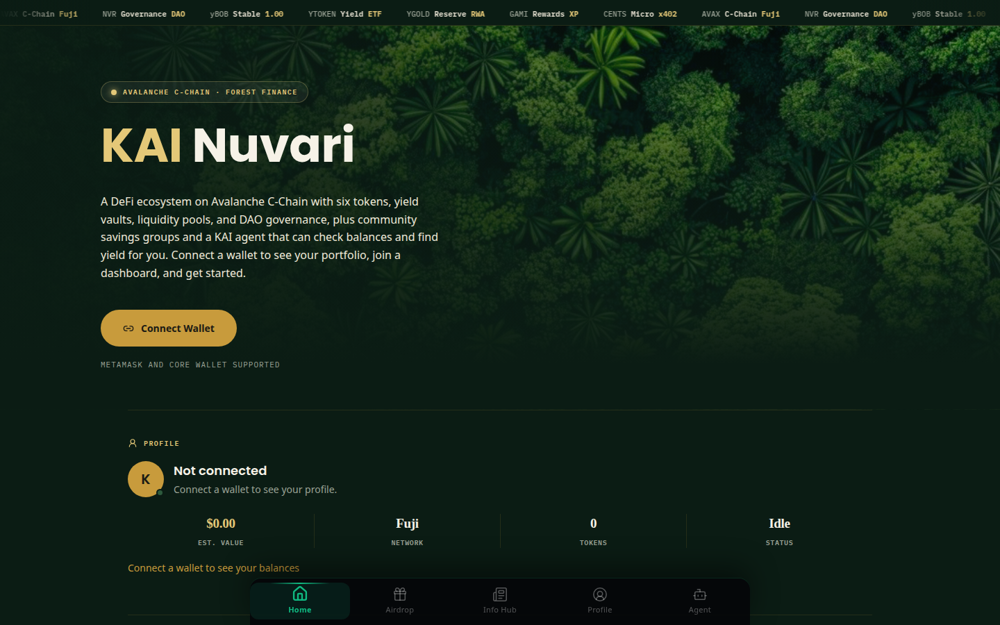
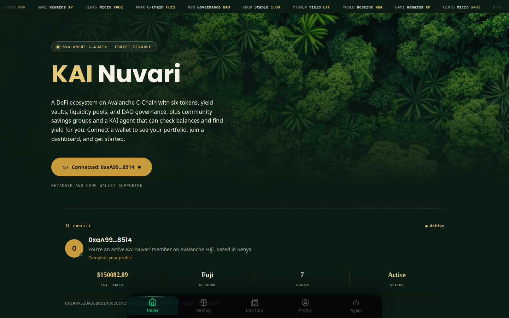
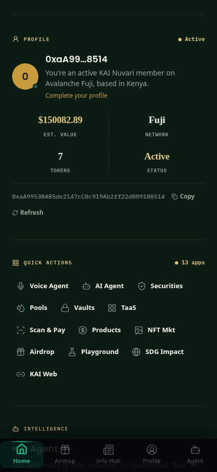
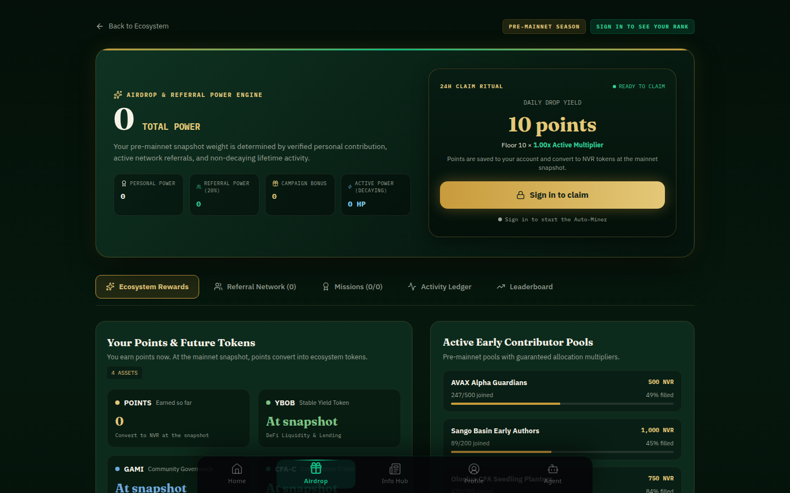
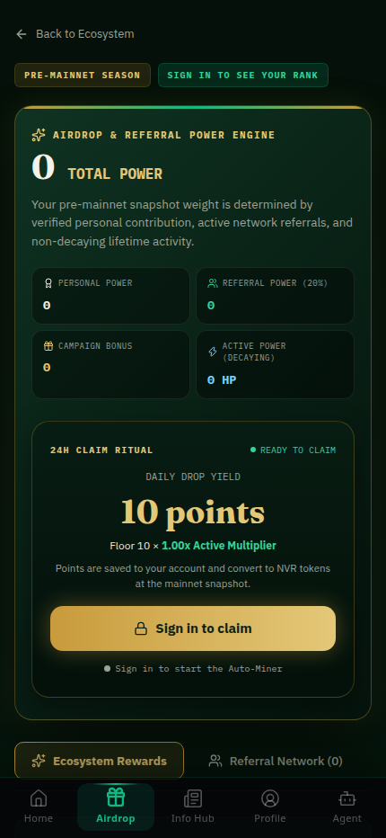
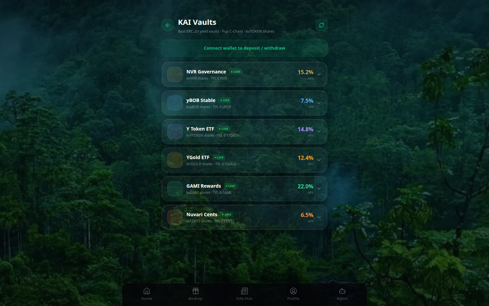
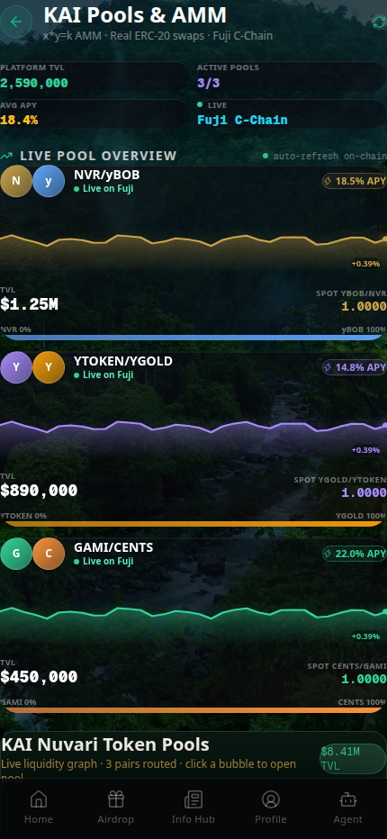
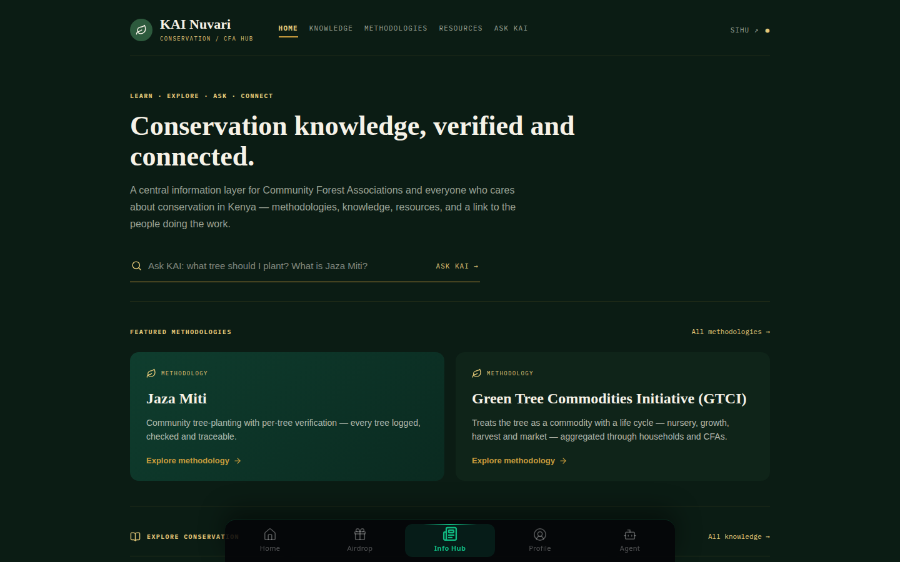

<div align="center">

# KAI Nuvari

**Community finance and conservation rewards on Avalanche.**

[](https://avax-frontend-seven.vercel.app/)
[](https://testnet.snowtrace.io)
[](#license)



</div>

## What it does

- **Save and grow money.** Yield vaults, liquidity pools and token swaps on Avalanche.
- **Earn for real impact.** Daily claims, missions, referrals and tree planting earn points.
- **Learn and ask.** News and conservation hubs, plus an AI agent you can talk to.

## See it in action

**1. Connect a wallet.** Your address, balances and tokens appear on the home screen.

 

**2. Claim your daily points.** One claim every 24 hours. Come back daily to grow your streak.

 

**3. Put tokens to work.** Deposit into vaults or add liquidity to pools.

 

**4. Learn about conservation.** Methodologies, guides and Ask KAI.



## How points work

| You do | You get |
|---|---|
| Claim daily | 10 points or more. Being active raises it up to 3x. |
| Complete missions | 10 to 100 points each, checked by the server |
| Invite friends | 20% of each active friend's points |
| Keep the page open | 0.05 points per second from the Auto-Miner |

Points are saved to your account. **At the mainnet launch, points convert into NVR tokens.** Claiming does not send coins to your wallet today.

## Quick start

```bash
cp avax-frontend/.env.example avax-frontend/.env.local   # add your keys
npm --prefix avax-frontend install
npm run dev:app                                          # http://localhost:3000
```

Need the AI agent or the hubs as well? See [RUN_APP.md](RUN_APP.md).

## Built with

Next.js 16 · React 19 · Solidity · Hardhat · viem · wagmi · Privy · Prisma · Neon Postgres · Paystack · FastAPI · Groq · Gemini

## Project layout

| Folder | What's inside |
|---|---|
| [`avax-frontend/`](avax-frontend) | The web app and its API |
| [`contracts/`](contracts) | Smart contracts (vaults, AMM, pools, escrow, airdrop vault) |
| [`scripts/`](scripts) | Deploy and liquidity scripts for Fuji |
| [`server.py`](server.py) | AI agent API |

## Status

**Live:** vaults, pools, swaps, sign-in, points, missions, referrals, hubs, AI agent.

**Next:** converting points to tokens, and the on-chain airdrop claim.

## License

ISC
