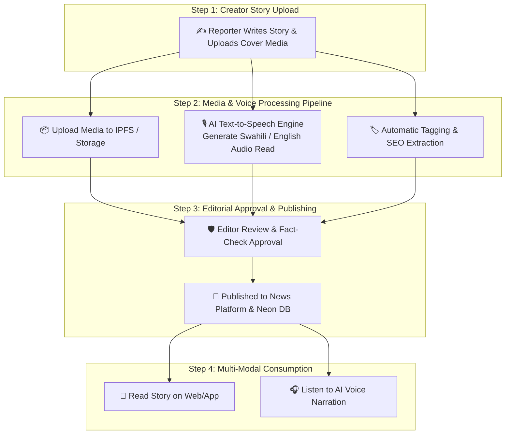

# Product Requirements Document (PRD) & Database Schema
## Decentralized News Engine, AI Voice Reader & Story Orchestration Pipeline

> **Version:** 1.0.0  
> **Platform:** KAI Nuvari Protocol (Next.js + Neon Postgres + IPFS + Web Speech / AI TTS API)  
> **Purpose:** A complete media publishing database, automated **AI Voice Reading pipeline**, high-performance **Media Upload system**, and **Story Editorial Orchestration** workflow.

---

## 1. Story Upload & Voice Reading Orchestration Architecture



---

## 2. Complete Database Schema (Prisma ORM)

File: `prisma/schema.prisma`

```prisma
// ============================================================================
// 1. NEWS CATEGORIES & TAXONOMY
// ============================================================================
model NewsCategory {
  id          String      @id @default(cuid())
  slug        String      @unique // e.g. "climate-environment", "agri-tech", "community-voices"
  name        String      // e.g. "Climate & Environment"
  description String?
  colorHex    String      @default("#e84142")

  stories     NewsStory[]

  @@map("news_categories")
}

// ============================================================================
// 2. NEWS STORIES & ARTICLES
// ============================================================================
model NewsStory {
  id                 String             @id @default(cuid())
  slug               String             @unique // e.g. "mau-forest-restoration-reaches-10k-trees"
  title              String
  subtitle           String?
  bodyMarkdown       String             // Full article content
  summary            String             // Short excerpt for news cards & AI TTS
  
  categoryId         String
  authorId           String             // Links to UnifiedUserProfile / CreatorProfile
  
  // News Flags & Metrics
  isBreakingNews     Boolean            @default(false)
  isFeatured         Boolean            @default(false)
  language           String             @default("sw") // "sw", "en", "sheng"
  estimatedReadMins  Int                @default(3)
  
  // Analytics
  viewsCount         Int                @default(0)
  listensCount       Int                @default(0)
  sharesCount        Int                @default(0)
  
  // Workflow Status
  status             StoryStatus        @default(DRAFT)
  publishedAt        DateTime?
  createdAt          DateTime           @default(now())
  updatedAt          DateTime           @updatedAt

  category           NewsCategory       @relation(fields: [categoryId], references: [id])
  voiceReads         AudioVoiceRead[]
  mediaAssets        StoryMediaAsset[]
  workflowLogs       EditorialLog[]

  @@index([slug])
  @@index([categoryId])
  @@index([status])
  @@index([isBreakingNews])
  @@map("news_stories")
}

enum StoryStatus {
  DRAFT
  MEDIA_PROCESSING
  VOICE_GENERATING
  UNDER_REVIEW
  APPROVED_SCHEDULED
  PUBLISHED
  ARCHIVED
}

// ============================================================================
// 3. AI VOICE READING INTEGRATION (TEXT-TO-SPEECH)
// ============================================================================
model AudioVoiceRead {
  id                 String            @id @default(cuid())
  storyId            String
  language           String            @default("sw") // "sw" (Swahili), "en" (English)
  voiceModel         String            @default("sw-KE-Wavenet-A") // Voice engine model name
  audioIpfsHash      String            // IPFS hash of generated MP3 audio narration
  audioFileUrl       String            // Public CDN URL for streaming
  durationSeconds    Int               // Exact audio length in seconds
  fileSizeBytes      Int
  status             VoiceGenStatus    @default(COMPLETED)

  story              NewsStory         @relation(fields: [storyId], references: [id], onDelete: Cascade)
  createdAt          DateTime          @default(now())

  @@index([storyId])
  @@map("audio_voice_reads")
}

enum VoiceGenStatus {
  QUEUED
  GENERATING
  COMPLETED
  FAILED
}

// ============================================================================
// 4. MEDIA ASSETS & PROVENANCE PIPELINE
// ============================================================================
model StoryMediaAsset {
  id                 String            @id @default(cuid())
  storyId            String
  mediaType          MediaType         @default(IMAGE)
  ipfsCid            String            // IPFS Content Identifier
  cdnUrl             String            // Optimized CDN URL
  fileName           String
  mimeType           String            // image/webp, video/mp4, audio/mpeg
  fileSizeBytes      Int
  width              Int?
  height             Int?
  caption            String?
  altText            String?

  story              NewsStory         @relation(fields: [storyId], references: [id], onDelete: Cascade)
  createdAt          DateTime          @default(now())

  @@index([storyId])
  @@map("story_media_assets")
}

enum MediaType {
  IMAGE
  VIDEO
  AUDIO_SNIPPET
  DOCUMENT_PDF
}

// ============================================================================
// 5. EDITORIAL WORKFLOW & ORCHESTRATION LOGS
// ============================================================================
model EditorialLog {
  id                 String            @id @default(cuid())
  storyId            String
  action             WorkflowAction
  performedByUserId  String            // Editor / System Worker ID
  note               String?
  timestamp          DateTime          @default(now())

  story              NewsStory         @relation(fields: [storyId], references: [id], onDelete: Cascade)

  @@index([storyId])
  @@map("editorial_logs")
}

enum WorkflowAction {
  STORY_CREATED
  MEDIA_UPLOADED
  VOICE_READ_GENERATED
  SUBMITTED_FOR_REVIEW
  REJECTED_REVISION_NEEDED
  APPROVED
  PUBLISHED
}
```

---

## 3. Story Upload & Processing Orchestration Route

This API pipeline orchestrates story creation, media processing, and AI voice narration generation in a single unified flow:

```ts
// src/app/api/news/stories/create/route.ts
import { NextResponse } from "next/server";
import { prisma } from "@/lib/prisma";

export async function POST(req: Request) {
  try {
    const body = await req.json();
    const { title, subtitle, bodyMarkdown, summary, categoryId, authorId, language, coverImageCid } = body;

    // 1. Create unique slug
    const slug = title.toLowerCase().replace(/[^a-z0-9]+/g, "-").replace(/(^-|-$)/g, "") + `-${Date.now().toString().slice(-4)}`;

    // 2. Create Story Record in DRAFT / PROCESSING status
    const story = await prisma.newsStory.create({
      data: {
        slug,
        title,
        subtitle,
        bodyMarkdown,
        summary,
        categoryId,
        authorId,
        language: language || "sw",
        status: "MEDIA_PROCESSING",
      },
    });

    // 3. Attach Cover Media Asset if provided
    if (coverImageCid) {
      await prisma.storyMediaAsset.create({
        data: {
          storyId: story.id,
          mediaType: "IMAGE",
          ipfsCid: coverImageCid,
          cdnUrl: `https://ipfs.io/ipfs/${coverImageCid}`,
          fileName: "cover-image.webp",
          mimeType: "image/webp",
          fileSizeBytes: 0,
        },
      });
    }

    // 4. Log Workflow Transition
    await prisma.editorialLog.create({
      data: {
        storyId: story.id,
        action: "STORY_CREATED",
        performedByUserId: authorId,
        note: "Initial story draft created & cover image attached.",
      },
    });

    return NextResponse.json({
      success: true,
      storyId: story.id,
      slug: story.slug,
      message: "Story submitted successfully. Queued for AI voice generation.",
    }, { status: 201 });

  } catch (error: any) {
    return NextResponse.json({ error: error.message }, { status: 500 });
  }
}
```

---

## 4. Voice Reader Component (Speech Synthesis + Player)

This frontend component plays the synthesized audio narration of any news story:

```tsx
// src/components/NewsVoiceReader.tsx
'use client';

import { useState, useRef, useEffect } from 'react';
import { Volume2, VolumeX, Play, Pause, RefreshCw, Radio } from 'lucide-react';

interface VoiceReaderProps {
  title: string;
  textToRead: string;
  audioUrl?: string; // Pre-synthesized MP3 audio URL from backend
  language?: string;
}

export default function NewsVoiceReader({ title, textToRead, audioUrl, language = 'sw' }: VoiceReaderProps) {
  const [isPlaying, setIsPlaying] = useState(false);
  const [isSpeakingWeb, setIsSpeakingWeb] = useState(false);
  const audioRef = useRef<HTMLAudioElement | null>(null);

  // Fallback to Web Speech API if no pre-rendered MP3 is available
  const speakWebSpeech = () => {
    if (typeof window === 'undefined' || !window.speechSynthesis) return;
    
    if (isSpeakingWeb) {
      window.speechSynthesis.cancel();
      setIsSpeakingWeb(false);
      return;
    }

    window.speechSynthesis.cancel();
    const cleanText = `${title}. ${textToRead.replace(/\*\*(.*?)\*\*/g, '$1')}`;
    const utterance = new SpeechSynthesisUtterance(cleanText);
    
    // Select voice matching language
    const voices = window.speechSynthesis.getVoices();
    const voice = voices.find(v => v.lang.startsWith(language)) || voices[0];
    if (voice) utterance.voice = voice;
    
    utterance.onend = () => setIsSpeakingWeb(false);
    setIsSpeakingWeb(true);
    window.speechSynthesis.speak(utterance);
  };

  const toggleAudio = () => {
    if (audioUrl && audioRef.current) {
      if (isPlaying) {
        audioRef.current.pause();
      } else {
        audioRef.current.play();
      }
      setIsPlaying(!isPlaying);
    } else {
      speakWebSpeech();
    }
  };

  return (
    <div className="w-full bg-[#12121a] border border-red-500/20 rounded-2xl p-4 text-white flex items-center justify-between shadow-xl">
      {audioUrl && <audio ref={audioRef} src={audioUrl} onEnded={() => setIsPlaying(false)} />}

      <div className="flex items-center gap-3">
        <button
          onClick={toggleAudio}
          className="w-10 h-10 rounded-full bg-gradient-to-r from-red-600 to-red-800 text-white flex items-center justify-center font-bold shadow-lg shadow-red-600/30 hover:scale-105 transition-transform cursor-pointer"
        >
          {isPlaying || isSpeakingWeb ? <Pause size={18} /> : <Play size={18} className="ml-0.5" />}
        </button>

        <div>
          <div className="flex items-center gap-1.5 text-[10px] font-bold text-red-400 uppercase tracking-wider">
            <Radio size={12} className="animate-pulse" />
            <span>AI Voice Reading</span>
          </div>
          <p className="text-xs text-white/80 font-medium mt-0.5">
            {isPlaying || isSpeakingWeb ? "Playing audio narration…" : "Listen to this story"}
          </p>
        </div>
      </div>

      <button
        onClick={toggleAudio}
        className="px-3 py-1.5 rounded-lg bg-white/5 border border-white/10 hover:bg-white/10 text-xs font-semibold text-white/70 hover:text-white transition-colors"
      >
        {isPlaying || isSpeakingWeb ? "Stop Reading" : "Listen Now 🎧"}
      </button>
    </div>
  );
}
```

---

## 5. Next Steps

1. Add news models to `prisma/schema.prisma` and push (`npx prisma db push`).
2. Build the **News Home & Breaking News Banner** (`src/app/news/page.tsx`).
3. Build the **Publisher Studio & Voice Orchestration Dashboard** (`src/app/news/studio/page.tsx`).
